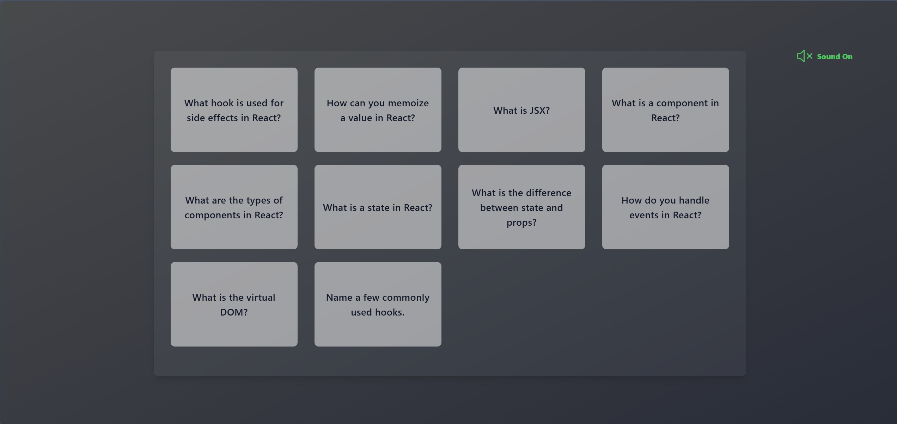

# 🔁 FlashBytes

### _A sleek React-based flashcard app focused on rapid learning and aesthetic flow._

## ✨ Features

-   🧠 Flip-based learning flow with smooth animations
-   🔇 Mute/unmute toggle synced to flip sound
-   🎴 Custom card UI with frosted glass and gradients

## 🚀 Getting Started

-   Pre-requisites:
    -   [Node.js](https://nodejs.org) (latest stable version)
    -   [Git](https://git-scm.com/downloads)
    -   [VS code](https://code.visualstudio.com/download) or your favorite editor
-   Clone or Download the project code from [here](https://github.com/SivaKrishna6745/FlashBytes)
-   Install Dependencies:
    `npm install`
    or
    `npm i`
-   Start the deployment server:
    `npm run dev`
-   Open your browser and visit:
    http://localhost:5173

## 🧰 Tech Stack

-   ReactJS
-   Vite
-   Tailwind CSS

## 🏠 Home Page

